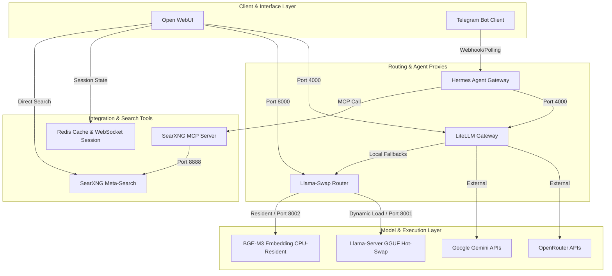

# Private & Hybrid AI Stack

A highly optimized, private, self-hosted AI orchestrator designed to run locally on an Ubuntu/Linux server. This repository wires together local GGUF models (accelerated via Vulkan/GPU), key-based external API endpoints (Gemini, OpenRouter), an intelligent routing proxy, an autonomous Telegram agent, and a web search RAG pipeline.

The core architecture optimizes resources dynamically by hot-swapping local models in and out of GPU VRAM on-demand while keeping lightweight embeddings instantly available.

---

## Architecture Overview



### Flow Highlights

1. **Dual Frontends**: Users interact via **Open WebUI** for standard conversations, documents, and RAG, while an autonomous **Nous Hermes Agent** operates in the background via Telegram.
2. **Hybrid Intelligence (LiteLLM)**: An API-key router that acts as a single gateway. It coordinates high-capability remote APIs (Gemini, OpenRouter) and routes queries to local GGUF instances as local fallback targets or dedicated endpoints.
3. **Dynamic VRAM Management (Llama-Swap)**: Instead of locking up GPU memory by keeping multiple large GGUF models resident, Llama-Swap runs a Vulkan-accelerated `llama-server` process only when a model receives a request. Inactive models are automatically unloaded after a 5-minute TTL (Time-To-Live), reclaiming VRAM completely.
4. **Resident CPU Embeddings**: The `bge-m3` embedding model runs continuously in system RAM (offloaded to CPU) with a `ttl: 0`, ensuring instant responsiveness for RAG ingestion/retrieval without competing for GPU VRAM.
5. **Private Web Grounding**: A self-hosted **SearXNG** instance acts as the search engine for both Open WebUI's built-in web fetch and the Hermes agent via a custom-built **Model Context Protocol (MCP)** server.

---

## Service Inventory & Port Map

All services run within a single docker-compose setup configured for host networking (`network_mode: "host"`) to ensure ultra-low latency inter-process communication:

| Service | Port | Base Image / Technology | Description |
| :--- | :--- | :--- | :--- |
| **Open WebUI** | `8080` (default) | `open-webui:main-slim` | Modern frontend for chats, document RAG, and model settings. |
| **LiteLLM** | `4000` | `berriai/litellm:main-latest` | Hybrid OpenAI-compatible routing gateway with fallback chains. |
| **Llama-Swap** | `8000` | `mostlygeek/llama-swap:vulkan` | Dynamic, Vulkan-accelerated GGUF runner & model switcher. |
| **Llama-Server (Active)** | `8001` | *Managed by Llama-Swap* | Active local LLM instance launched dynamically. |
| **Llama-Server (Embed)** | `8002` | *Managed by Llama-Swap* | Continuous background instance for BGE-M3 embedding (CPU only). |
| **SearXNG** | `8888` | `searxng/searxng:latest` | Privacy-respecting meta-search engine for web grounding. |
| **Hermes Gateway** | `8080` | `nousresearch/hermes-agent:latest` | Autonomous agent with Telegram Bot integration. |
| **SearXNG MCP Server** | *STDIO* | `Node.js (Custom MCP SDK)` | Standard Model Context Protocol tool enabling search for agents. |
| **Redis** | `6379` | `redis:alpine` | Session, cache, and WebSocket coordinator. |
| **PostgreSQL** | `5432` | `postgres:16-alpine` | Relational backend database specifically for LiteLLM. |

---

## Core System Configurations

### 1. LiteLLM Proxy (`litellm_config.yaml`)
LiteLLM serves as the front-facing API server. It defines several logical pools:
*   **`OpenRouter` Pool (Failover Group)**: Automatically routes to remote high-capacity models via OpenRouter (e.g., `gpt-oss-120b:free` $\rightarrow$ `glm-4.5-air:free` $\rightarrow$ `gemma-4-31b-it:free`). If all external endpoints fail, it can fall back directly to local GGUF models routed through `llama-swap`.
*   **`Gemini-High` & `Gemini-Low` Pools**: Grouped models mapping directly to your native Gemini APIs (e.g., `gemini-3.1-flash-lite`, `gemini-2.5-flash`, and Gemma models).
*   **Usage-Based Routing**: Utilizes `usage-based-routing-v2` strategy for smart traffic management.

### 2. Llama-Swap Orchestration (`llama-swap.yaml`)
Configured to manage high-efficiency GGUF swapping on Vulkan. It maps model targets to execution presets:
*   **Dynamic TTL**: Interactive LLM models are configured with a 300-second (5-minute) timeout. If idle, Llama-Swap kills the underlying `llama-server` process to free GPU VRAM.
*   **Pre-configured Presets**: Models like `Qwen3.5-2B`, `Qwen3.5-4B`, `Qwen3.5-9B`, `Qwen3.5-27B`, `Qwen3.5-35B`, and `Gemma-4-E4B` are loaded with strict memory limit controls (`--mlock`, `q8_0` or `q4_0` cache formatting, flash attention, and pre-adjusted temperature settings).
*   **Cognitive Preset Swapping**: Models are exposed via unique names representing distinct system prompts and sampler configurations:
    *   `[Thinking · General]`: Thinking mode enabled (`enable_thinking: true`), presence penalty set high for creative/open discussions.
    *   `[Thinking · Coding]`: Temperature lowered to `0.6` and presence penalty stripped for deterministic algorithmic accuracy.
    *   `[Instruct · General]`: Standard direct generation with thinking paths turned off.
*   **BGE-M3 Embeddings (`bge-m3-q8_0.gguf`)**: Preloaded at boot, locked into memory (`ttl: 0`), set to run exclusively on the CPU host (`-ngl 0` / 0 VRAM layers) to provide continuous, zero-VRAM-impact embeddings for vector indexing and document retrieval.

### 3. Model Context Protocol Search (`searxng-mcp`)
A custom Node.js MCP server located in `./searxng-mcp`.
*   Written using the `@modelcontextprotocol/sdk`.
*   Registers a single `search` tool taking a `query` parameter.
*   Uses the Docker host gateway (`172.17.0.1:8888`) to execute queries against the containerized SearXNG service, parsing search engines, filtering results, and returning a concise markdown summary directly back to the calling agent.

---

## Deployment & Setup

### Prerequisites
*   **Linux/Ubuntu Host** with Docker and Docker Compose installed.
*   **Vulkan Drivers & ICD** loader setup on the host for GPU execution (critical for the `llama-swap` container to offload layers to the GPU).
*   **Node.js (v18+)** installed if running/testing the MCP server locally outside of the container.

### Step 1: Prepare Environment Variables
Create a `.env` file in the root directory:

```bash
# PostgreSQL DB Settings
DB_USER=litellm
DB_PASSWORD=select_a_strong_password
DB_NAME=litellm

# Remote LLM Keys
OPENROUTER_API_KEY=your_openrouter_api_key_here
GEMINI_API_KEY=your_gemini_api_key_here

# LiteLLM Configuration
LITELLM_MASTER_KEY=sk-hermes-your_master_key_here

# SearXNG & Open WebUI Configurations
SEARXNG_SECRET=generate_a_random_hex_string
WEBUI_SECRET_KEY=generate_another_random_hex_string

# Telegram Agent Configuration
TELEGRAM_BOT_TOKEN=your_telegram_bot_token_from_botfather
TELEGRAM_ALLOWED_USERS=["your_telegram_user_id"]
```

### Step 2: Download Models
Organize your GGUF models within `/home/alta/ai-stack` (or modify the `llama-swap` volume mapping in `docker-compose.yml` to match your local directory). Your folder structure should reflect:

```text
/home/alta/ai-stack/
├── models/
│   ├── Qwen3.5-2B/
│   │   ├── Qwen3.5-2B-UD-Q4_K_XL.gguf
│   │   └── mmproj-F16.gguf
│   ├── Qwen3.5-4B/
│   │   ├── Qwen3.5-4B-UD-Q4_K_XL.gguf
│   │   └── mmproj-F16.gguf
│   ├── embeddModels/
│   │   └── bge-m3-q8_0/
│   │       └── bge-m3-q8_0.gguf
│   └── ... (Other models as configured in llama-swap.yaml)
```

### Step 3: Launch Stack
Spin up the orchestration stack in detached mode:

```bash
docker compose up -d
```

### Step 4: Verify Health
Check container logs and active ports:

```bash
# View services status
docker compose ps

# Follow logs of the model swapper
docker compose logs -f llama-swap

# Check active ports
ss -tulpn | grep -E '4000|8000|8888|8080|6379'
```

---

## Operations Guide

### Adding a New GGUF Model to Llama-Swap
1.  Download the `.gguf` file and place it in the appropriate folder under your models directory.
2.  Open `llama-swap.yaml` and add a new model entry mapping your model name to its initialization parameters:
    ```yaml
    "My-New-Model-Instruct":
      <<: *on_8001
      cmd: >
        /app/llama-server
        --port 8001 --host 0.0.0.0
        --model /models/models/NewFolder/my-model.gguf
        --fit on --mlock
        -c 16384 -t 4 --flash-attn on
    ```
3.  Llama-Swap will automatically monitor config changes because of the `-watch-config` flag. The next request to `My-New-Model-Instruct` will spawn the new model automatically.

### Running/Testing the SearXNG MCP Server Directly
If you want to debug or use the MCP server in another desktop client (like Claude Desktop):
1.  Navigate to the directory:
    ```bash
    cd searxng-mcp
    ```
2.  Install dependencies:
    ```bash
    npm install
    ```
3.  Register it in your desktop client configuration:
    ```json
    "mcpServers": {
      "searxng-mcp": {
        "command": "node",
        "args": ["/absolute/path/to/ai-stack/searxng-mcp/index.js"]
      }
    }
    ```

---

## License & Notes
This repository is configured as a private production-grade orchestrator. Keep credentials secure and monitor resource utilization (`docker stats`) when scaling local GGUF models.
